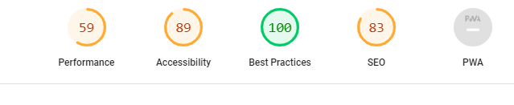
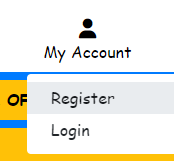
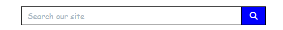
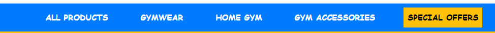
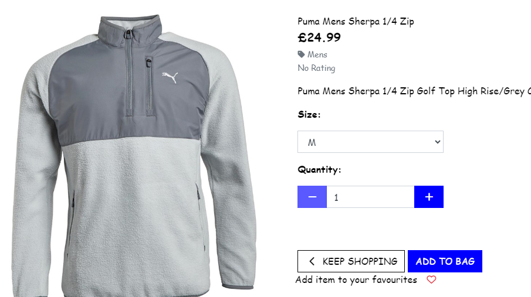
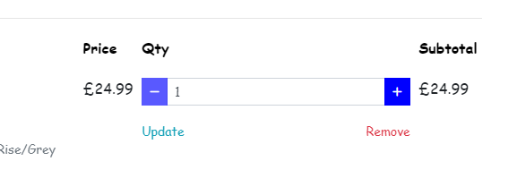
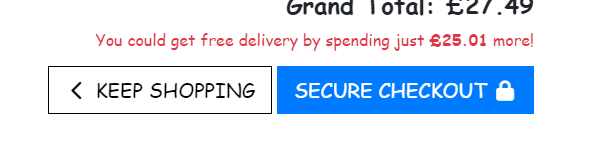
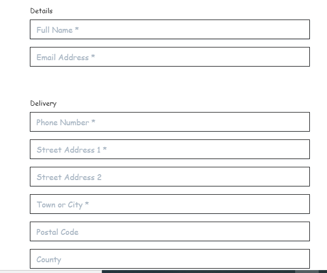
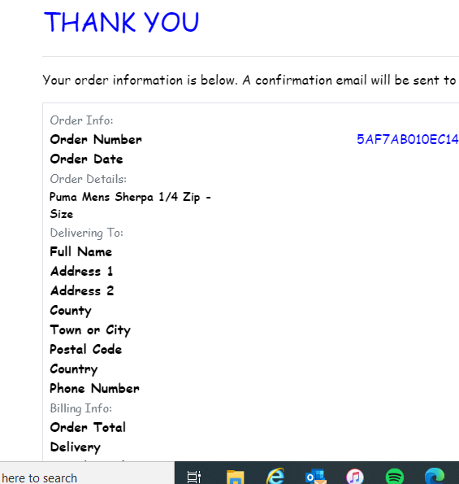

# Shop Active

## Code institute / City of Bristol College Milestone Project 4

Shop Active is an online fitness store selling clothing for the gym and other activitites. It also sells accessories and equipment like machines and weights for a home gym. This is my fourth milestone project for the web development course at Code Institute/ City of Bristol College. For this project I had to build a full-stack site based around buisness logic used to control a centrally-owned dataset. It required an authentication mechanism and to provide paid access to the site data and/ or other activities based on the dataset, such as the purchase of a product or service.

Click <a href="https://shop-active.herokuapp.com/">here</a> to view the live website.

## User Experince 
In this section, I will be providing information on the UX process. Focusing on who the ShopActive website is for, the main aims of this project and how the website helps to meet the users needs.

The Project Goals:
<ul>
    <li>An online place for someone to find gymwear, gym accessories and gym equipment</li>
    <li>Enable users to register an account </li>
    <li>Enable users to add items to a shopping bag</li>
    <li>Enable users to be able to complete an order of items</li>
</ul>

## User stories

A new user:
<ul>
    <li>Easy to navigate the website and find items</li>
    <li>Able to sign up/ register an account for the website</li>
    <li>View details of each individual item</li>
    <li>Easily identify clearance items and speacial offers</li>
    <li>Search for a product via a specific category or word</li>
</ul>

#### Returning users

Current user:
<ul>
    <li>Easy to navigate the website and find items</li>
    <li>Able to sign up/ register an account for the website</li>
    <li>View details of each individual item</li>
    <li>Easily identify clearance items and speacial offers</li>
    <li>Search for a product via a specific category or word</li>
</ul>

Buisness Owner:
<ul>
    <li>Give users easy navigation to find products</li>
    <li>Give users easy accessibility to special offers</li>
    <li>Let users create an account with the website</li>
    <li>An easy and simple checkout process</li>
</ul>


## User Centered Design
### 1. Strategy Plane
The User Centered Design process started with looking at the project goals and creating the user stories. These influenced the design and layout of the project.


### 2. Scope Plane
An online e-commerce store for ShopActive. A company selling gymwear, gym accessories and home gym equipemnt.


### 3. Structure Plane
After idenifying the needs of the business owner and users that will access the website the below was identified as required:
<ul>
    <li>Blue and White colour scheme to match the buisness colours</li>
    <li>Same layout throughout the site</li>
    <li>Wasy and clear navigation for the user</li>
    <li>User register, login and logout easy to find</li>
    <li>Fully working checkout</li>
</ul>


### 4. Skeleton Page
To create the wireframes for the product I used <a href="https://www.figma.com/>">Figma</a>. They were created to appear as they would on a desktop, table and mobile.

We have a header containing the logo and nav bar.

The mobile version is slightly different to help with device responsiveness.

A footer is also included which will include links for the website, as well as the social netowkr links.

#### Wireframes
Desktop:
<ul>
    <li><a href="documentation/wireframe/Desktop-index.png">Index Page</a></li>
    <li><a href="documentation/wireframe/Desktop-products.png">Products Page</a></li>
    <li><a href="documentation/wireframe/Desktop-product-detail.png">Product Detail Page</a></li>
    <li><a href="documentation/wireframe/Desktop-bag.png">Bag Page</a></li>
    <li><a href="documentation/wireframe/Desktop-profile.png">Profile page</a></li>
    <li><a href="documentation/wireframe/Desktop-product-management.png">Product Management Page</a></li>
</ul>


Tablet:
<ul>
    <li><a href="documentation/wireframe/tablet-index.png">Index Page</a></li>
    <li><a href="documentation/wireframe/tablet-products.png">Products Page</a></li>
    <li><a href="documentation/wireframe/tablet-product-detail.png">Product Detail Page</a></li>
    <li><a href="documentation/wireframe/tablet-bag.png">Bag Page</a></li>
    <li><a href="documentation/wireframe/tablet-profile.png">User Profile Page</a></li>
    <li><a href="documentation/wireframe/tablet-product-management.png">Product Management Page</a></li>
</ul>


Mobile:
<ul>
    <li><a href="documentation/wireframe/Phone-index.png">Index Page</a></li>
    <li><a href="documentation/wireframe/Phone-products.png">Products Page</a></li>
    <li><a href="documentation/wireframe/Phone-product-detail.png">Product Detail Page</a></li>
    <li><a href="documentation/wireframe/Phone-bag.png">Bag Page</a></li>
    <li><a href="documentation/wireframe/Phone-profile.png">User Profile Page</a></li>
    <li><a href="documentation/wireframe/Phone-product-management.png">Product Management Page</a></li>
</ul>


### 5. Surface Plane
#### Design
Due to the modern society of users now looking for information on mobile phones and tablet this was created with a mobile-first approach.

#### Colour Scheme
The colour scheme was chosen to be simple, clean, bright and visually appealing. Blue is the chosen as this is the primary colour as this is the colour of the buisness. There will be slight variations of the blue throught the system. White has been chosen as the background colour to help the chosen colours stand out.


<sub>*Colour palette created at* [coolors.co](https://coolors.co/7ae9f0-04c6d3-fafafa-0420d4-000000).</sub>

<ul>
    <li>#0275d8. This was chosen for the navigation bar and footer as its the blue chosen by the buisness. This colour was included with Boostrap</li>
    <li>#5CB85C. This has been used in the success message and is included with Boostrap</li>
    <li>#FAFAFA. Used as background where there is no background image and also for some of the text and maouse hover</li>
    <li>#F0AD4E. Used for messages that give the user a warning. Incorperated from Boostrap</li>
    <li>#000000. Used for the text.</li>
    <li>#d9534f. Used for the failed massages. Red colour incorperated from Boostrap.</li>
</ul>

#### Icons
Icons were used alongside to help the user understand sections of the website at a glance. I have taken the icons used in this project from Font Awesome (https://fontawesome.com/).

## Development
During the development of this project it was decided that two new features were to be added. This included a review section for each product and a favourites list for the user to favourite products to help them find them at a later date.


### Database Struture


## Features
### Consistent features on all pages
<ul>
    <li>Header, contains the same company logo and navigation bar</li>
    <li>Footer, Contains social media links and links for the website with a company description also in there. It also has a newsletter sign up section.</li>
</ul>

### Other features
<ul>
    <li>Ability for the user to create an account</li>
    <li>User can log in and out of their account</li>
    <li>Users can add products to a bag and favourites list</li>
    <li>Users can delete products from their bag or favourites</li>
    <li>Logged in users can also review a product and delete that review</li>
</ul>

## Future Features
<ul>
    <li>Allow users to edit their review</li>
    <li>Edit the clearance page to show the price before and the current clearance price</li>
    <li>Add pop up modals so the user can delete anything with an accidental click</li>
    <li>Add a contact us page incase of any order issues</li>
</ul>

## Technologies used
The below languages were used in this project:
<ul>
    <li>HTML</li>
    <li>CSS</li>
    <li>JavaScript</li>
    <li>Python</li>
    <li>JQuery - imported from Materialize script</li>
    <li>SQLite</li>
    <li>Django</li>
    <li>Postgres</li>
    <li>Google Emails</li>
    <li>Stripe</li>
    <li>Amazon Web Services</li>
</ul>

## websites used
<ul>
    <li>Am I Responsive (http://ami.responsivedesign.is/). This was used to create the mock up image at the top of this readme document</li>
    <li>Code Institute (https://codeinstitute.net/). Modules and walk-through projects have been used and copied in this project</li>
    <li>Coolors (https://coolors.co/7ae9f0-04c6d3-fafafa-0420d4-000000). Used to create website colour scheme and palette</li>
    <li>Font Awesome (https://fontawesome.com/). Used for icons within website</li>
    <li>Chrome Developer tools. Used to test website for buys and responsiveness</li>
    <li>Google Fonts. Used to incorporate fonts in website</li>
    <li>Github. Used for site respository</li>
    <li>Gitpod. Online developer tool used to build and develop this project</li>
    <li>Heroku. To deploy finished website</li>
    <li>W3C CSS Validation. Used to validate projects CSS code</li>
    <li>W3C HTML Validation. Used ti validate projects html pages / code</li>
    <li>Figma. Used to create websites wireframes</li>
</ul>

## Performance Testing
### Lighthouse testing
I used the chrome extension 'Lighthouse' to test the performance of the website. Below is the capture of my report.



### W3C HTML Validator
All pages checked and no errors found within the HTML.


### W3C CSS Validator
No error where found in the CSS code when that went through the validator.


## Manual Testing
There are two types of users for this website:
<ul>
    <li>An admin(administrator) user account</li>
    <li>A regular user account</li>
    <li>When making a payment as a regular user, a test credit card of 4242424242424242 has been set up for the card number</li>
    <li>For the expiry date, cvc and postal code any series number(s) can be used(once they meet the mimimum values)</li>
    <li>I also tested the uk card number to ensure it asks for a UK postcode and not a zip code. This card number is 4000008260000000</li>
</ul>

The website was tested on the following browsers:
<ul>
    <li>Google Chrome - Version 106.0.5249.91</li>
    <li>Safari on iPhone</li>
    <li>Opera - Version 90.0.4480.80</li>
    <li>Microsoft Edge - Version 105.0.1343.53</li>
    <li>Firefox - Version 105.01</li>
</ul>

All browsers where tested fully and the website behaved as expected on them. I tested:

<ul>
    <li>That the user can log in and out</li>
    <li>That if the wrong password is entered the user is told and can try again</li>
    <li>That the user can register</li>
    <li>That the user can add, edit and delete items from their bag</li>
    <li>That the user can add and delete items from their favourites</li>
    <li>That the user can edit default address details in their profile</li>
    <li>That an admin user can add, delete and edit a product</li>
    <li>That an admin user can access the admin portal</li>
</ul>

## Device & responsiveness testing
The below devices where tested to see how the website behaved on them and their responsiveness using Google Developer Chrome tools.

<ul>
    <li>iPhone SE</li>
    <li>iPhone Xr</li>
    <li>iPhone12 Pro</li>
    <li>Pixel 5</li>
    <li>Samsung S20 Ultra</li>
    <li>iPad Air</li>
    <li>iPad Mini</li>
    <li>Surface Pro 7</li>
</ul>

It was also tested on the below laptop and desktop sizes:

<ul>
    <li>15" Laptop (1024 x 800)</li>
    <li>22" Desktop (1680 x 1050)</li>
    <li>24" Desktop (1920 x 1200)</li>
</ul>

### Tested User Stories
Below I will discuss how the project met the requirements of the user stories from earlier.

#### New User
So for a new user of this website they needed to be able to complete below:
<ul>
    <li>sign up</li>
    <li>Search for an item</li>
    <li>Add an item to bag</li>
    <li>Delete an item from the bag</li>
    <li>Update an item in the bag</li>
    <li>Complete an order with checkout system</li>
</ul>

After testing this is proven to work for the new user.

User can sign up to the website by clicking account then register or clicking register in the footer:




A user can search for an item via the search bar or the nav bar:



A User can add items to the bag from the product details page:


A User can delete and update an item in the bag by clicking either update or remove:


A user can complete a fully checkout by first secure checkout in the bag, filling out the billing details, clicking complete order and waiting for the confirmation page:





The above also met the requirements of a current/ returning user:
<ul>
    <li>Login</li>
    <li>Search for an item</li>
    <li>Add an item to bag</li>
    <li>Delete an item from the bag</li>
    <li>Update an item in the bag</li>
    <li>Complete an order with checkout system</li>
</ul>


We have also met the buisness owners requirement of:
<ul>
    <li>Give users easy navigation to find products</li>
    <li>Give users easy accessibility to special offers</li>
    <li>Let users create an account with the website</li>
    <li>An easy and simple checkout process</li>
</ul>

## Bugs
I had a few bugs with this project throughout. The first was not showing the email and order amounts when an order was completed. I rebuilt the database with ElephantSQL as it was workin on the local database. This resolved that issue.

Second issue was with the footers on all pages, it wasn't filling the bottom of the page or was showing in the middle of the page covering the products and forms. It turns out i had some closing tags missing in the HTML and this resolved that issue.


### Deployment to Heroku

1. Log in to your Heroku account and create a new App.
2. Set the environment variables in Settings > Reveal Config Variables
3. The following Variables must be set 
```
AWS_ACCESS_KEY_ID = <INSERT YOUR AWS ACCESS KEY>
AWS_SECRET_ACCESS_KEY = <INSERT YOUR AWS SECRET ACCESS KEY>
DATABASE_URL = <INSERT DATABASE URL>
EMAIL_HOST_PASS = <INSERT EMAIL HOST PASS>
EMAIL_HOST_USER = <INSERT HOST EMAIL>
SECRET_KEY = <INSERT YOUR SECRET KEY>
STRIPE_PUBLIC_KEY = <INSERT STRIPE PUBLIC KEY>
STRIPE_SECRET_KEY = <INSERT STRIPE SECRET KEY>
STRIPE_WH_SECRET = <INSERT STRIPE WEBHOOK SECRET KEY>
USE_AWS = True
```
4. Create requirements.txt from your project with the help of ```pip3 freeze --local > requirements.txt ```
5. Create a Procfile ```echo web: python app.py > Procfile``` 
6. Commit changes to Git ```git add . ``` followed by ```git commit -m ""```
7. Log in to heroku from your terminal ```heroku login```
8. Add exisitng repository to Heroku ```heroku git:remote -a <your repository>```
9. Push changes to Heroku ```git push heroku master```


## Credits
In this project a lot of the structure was taken from the Boutique Ado walkthrough from Code Institute and edited to suit the needs of this project.

The products were taken from the below websites:
<ul>
    <li>https://www.fitness-superstore.co.uk/</li>
    <li>https://www.mandmdirect.com/</li>
    <li>https://www.amazon.co.uk/</li>
</ul>

Boostrap has been heavily used throughtout this project. 